# Authentication Flow Diagram - Sequence

```mermaid
sequenceDiagram
    autonumber
    participant Browser
    participant Middleware
    participant AstroAPI as Astro API
    participant SupabaseAuth as Supabase Auth
    participant DB as PostgreSQL

    Note over Browser,DB: User Registration Flow (US-001)
    
    Browser->>Browser: User fills registration form
    Browser->>Browser: Client validation (email, password)
    Browser->>AstroAPI: POST /api/auth/register
    AstroAPI->>AstroAPI: Validate with Zod schema
    AstroAPI->>SupabaseAuth: signUp(email, password)
    SupabaseAuth->>DB: Check if email exists
    
    alt Email already exists
        DB-->>SupabaseAuth: Email found
        SupabaseAuth-->>AstroAPI: Error: Email exists
        AstroAPI-->>Browser: 409 Conflict
        Browser->>Browser: Display error message
    else Email available
        DB-->>SupabaseAuth: Email available
        SupabaseAuth->>DB: Create user record
        SupabaseAuth->>SupabaseAuth: Generate access and refresh tokens
        SupabaseAuth-->>AstroAPI: Return user and session
        AstroAPI->>AstroAPI: Set HttpOnly cookies
        AstroAPI-->>Browser: 201 Success with session
        Browser->>Browser: Redirect to /dashboard
    end

    Note over Browser,DB: User Login Flow (US-002)
    
    Browser->>Browser: User fills login form
    Browser->>AstroAPI: POST /api/auth/login
    AstroAPI->>AstroAPI: Validate with Zod schema
    AstroAPI->>SupabaseAuth: signInWithPassword(email, password)
    SupabaseAuth->>DB: Verify credentials
    
    alt Invalid credentials
        DB-->>SupabaseAuth: No match found
        SupabaseAuth-->>AstroAPI: Error: Invalid credentials
        AstroAPI-->>Browser: 401 Unauthorized
        Browser->>Browser: Display error message
    else Valid credentials
        DB-->>SupabaseAuth: User verified
        SupabaseAuth->>SupabaseAuth: Generate access and refresh tokens
        SupabaseAuth-->>AstroAPI: Return user and session
        AstroAPI->>AstroAPI: Set HttpOnly cookies
        AstroAPI-->>Browser: 200 Success with session
        Browser->>Browser: Redirect to /dashboard
    end

    Note over Browser,DB: Session Verification on Protected Route
    
    Browser->>Middleware: GET /dashboard (with cookies)
    Middleware->>Middleware: Read cookies
    Middleware->>SupabaseAuth: getSession(access_token)
    
    alt Token expired
        SupabaseAuth->>SupabaseAuth: Check refresh_token validity
        alt Refresh token valid
            SupabaseAuth->>SupabaseAuth: Generate new access_token
            SupabaseAuth-->>Middleware: New session
            Middleware->>Middleware: Update cookies
            Middleware->>Middleware: Inject user to locals
            Middleware->>Browser: Continue to page
        else Refresh token invalid
            SupabaseAuth-->>Middleware: Session expired
            Middleware-->>Browser: 302 Redirect to /auth/login
        end
    else Token valid
        SupabaseAuth-->>Middleware: Valid session
        Middleware->>Middleware: Inject user to locals
        Middleware->>Browser: Continue to page
    end

    Note over Browser,DB: Protected API Call (e.g., AI Generation)
    
    Browser->>Middleware: POST /api/ai/generate (with cookies)
    Middleware->>SupabaseAuth: getSession(access_token)
    SupabaseAuth-->>Middleware: Valid session with user_id
    Middleware->>Middleware: Inject user to locals
    Middleware->>AstroAPI: Forward request
    AstroAPI->>AstroAPI: Get user_id from locals.user
    AstroAPI->>DB: INSERT flashcards with user_id
    DB->>DB: RLS policy checks user_id
    DB-->>AstroAPI: Success
    AstroAPI-->>Browser: 201 Created

    Note over Browser,DB: User Logout Flow (US-003)
    
    Browser->>AstroAPI: POST /api/auth/logout (with cookies)
    AstroAPI->>SupabaseAuth: signOut()
    SupabaseAuth->>SupabaseAuth: Invalidate session
    SupabaseAuth-->>AstroAPI: Success
    AstroAPI->>AstroAPI: Clear cookies
    AstroAPI-->>Browser: 200 Success
    Browser->>Browser: Redirect to /auth/login

    Note over Browser,DB: Password Reset Flow - Step 1 (US-004)
    
    Browser->>Browser: User fills email in reset form
    Browser->>AstroAPI: POST /api/auth/reset-password
    AstroAPI->>AstroAPI: Validate email with Zod
    AstroAPI->>SupabaseAuth: resetPasswordForEmail(email)
    SupabaseAuth->>DB: Check if user exists
    
    alt User exists
        DB-->>SupabaseAuth: User found
        SupabaseAuth->>SupabaseAuth: Generate recovery token
        SupabaseAuth->>SupabaseAuth: Send email with reset link
        SupabaseAuth-->>AstroAPI: Email sent
    else User not found
        DB-->>SupabaseAuth: User not found
        SupabaseAuth-->>AstroAPI: Silent success
    end
    
    Note over AstroAPI,Browser: Always return success for security
    AstroAPI-->>Browser: 200 Success message
    Browser->>Browser: Display check email message

    Note over Browser,DB: Password Reset Flow - Step 2 (US-004)
    
    Browser->>Browser: User clicks email link with token
    Browser->>Middleware: GET /auth/update-password?token=xxx
    Middleware->>Middleware: Allow access (public route)
    Middleware->>Browser: Render update password page
    Browser->>Browser: User fills new password
    Browser->>AstroAPI: POST /api/auth/update-password
    AstroAPI->>AstroAPI: Validate password with Zod
    AstroAPI->>SupabaseAuth: updateUser(password)
    
    alt Token valid
        SupabaseAuth->>DB: Update user password
        DB-->>SupabaseAuth: Password updated
        SupabaseAuth-->>AstroAPI: Success
        AstroAPI-->>Browser: 200 Success
        Browser->>Browser: Redirect to /auth/login
    else Token invalid or expired
        SupabaseAuth-->>AstroAPI: Error: Invalid token
        AstroAPI-->>Browser: 400 Bad Request
        Browser->>Browser: Display error message
    end

    Note over Browser,DB: Access Denied - Unauthenticated User
    
    Browser->>Middleware: GET /dashboard (no cookies)
    Middleware->>SupabaseAuth: getSession()
    SupabaseAuth-->>Middleware: No session
    Middleware-->>Browser: 302 Redirect to /auth/login?redirect=/dashboard
```

<mermaid_diagram>



</mermaid_diagram>

## Authentication Flow Description

### Participants

1. **Browser**: User interface running React components and forms
2. **Middleware**: Astro middleware that intercepts all requests
3. **Astro API**: Server-side API endpoints for authentication and business logic
4. **Supabase Auth**: Authentication service managing users, sessions, and tokens
5. **PostgreSQL**: Database with Row Level Security (RLS) policies

### Key Flows

#### 1. User Registration (US-001)

**Purpose**: Create new user account with email as username

**Steps**:
1-2. User fills form, client validates email format and password complexity
3. Browser sends POST to `/api/auth/register`
4. Server validates data with Zod schema
5. API calls Supabase Auth `signUp()`
6. Supabase checks if email already exists in database

**Success Path** (7-13):
- Email is available
- Supabase creates user record
- Generates JWT access token (1 hour) and refresh token (30 days)
- API sets HttpOnly cookies: `sb-access-token`, `sb-refresh-token`
- Returns user data and session
- Browser redirects to `/dashboard`

**Error Path** (7-10):
- Email already exists
- Returns 409 Conflict error with message "Email already exists"
- Browser displays error to user

#### 2. User Login (US-002)

**Purpose**: Authenticate existing user and create session

**Steps**:
1. User fills login form with email (username) and password
2. Browser sends POST to `/api/auth/login`
3. Server validates credentials with Zod schema
4. API calls Supabase Auth `signInWithPassword()`
5. Supabase verifies credentials against database

**Success Path** (6-12):
- Credentials are valid
- Generates new access and refresh tokens
- API sets HttpOnly cookies
- Returns user data and session
- Browser redirects to `/dashboard`

**Error Path** (6-9):
- Invalid email or password
- Returns 401 Unauthorized with generic message "Invalid email or password"
- Browser displays error (no indication which field is wrong for security)

#### 3. Session Verification on Protected Route

**Purpose**: Validate user session before accessing protected pages

**Steps**:
1. Browser requests protected page (e.g., `/dashboard`) with cookies
2. Middleware reads `sb-access-token` and `sb-refresh-token` from cookies
3. Middleware calls Supabase `getSession()`

**Token Valid Path** (4-6):
- Access token is still valid (< 1 hour old)
- Supabase returns session with user data
- Middleware injects `user` object into `locals`
- Request continues to protected page

**Token Expired, Refresh Valid Path** (4-9):
- Access token expired but refresh token valid
- Supabase automatically generates new access token
- Middleware updates cookies with new access token
- Injects user into locals
- Request continues to protected page

**Session Invalid Path** (4-5):
- Both tokens expired or invalid
- Supabase returns "Session expired"
- Middleware redirects to `/auth/login?redirect=/dashboard`

#### 4. Protected API Call with RLS

**Purpose**: Demonstrate how authenticated requests interact with database RLS

**Steps**:
1. Browser sends API request (e.g., POST `/api/ai/generate`) with cookies
2. Middleware validates session (same as above)
3. Supabase returns valid session with `user_id`
4. Middleware injects user into `locals`
5. Request forwarded to API endpoint
6. API extracts `user_id` from `locals.user.id`
7. API inserts data to database including `user_id`
8. PostgreSQL RLS policy automatically verifies `user_id = auth.uid()`
9. Database returns success
10. API returns 201 Created to browser

**Security**: RLS ensures users can only access their own data

#### 5. User Logout (US-003)

**Purpose**: End user session and clear authentication state

**Steps**:
1. User clicks "Logout" button in UserMenu
2. Browser sends POST to `/api/auth/logout` with cookies
3. API calls Supabase `signOut()`
4. Supabase invalidates session tokens
5. API clears HttpOnly cookies (sets Max-Age=0)
6. Returns 200 Success
7. Browser redirects to `/auth/login`

**Note**: Even on error, logout succeeds to prevent stuck authentication states

#### 6. Password Reset - Step 1: Request (US-004)

**Purpose**: Send password reset email (PRD: "simplified, insecure" - uses email)

**Steps**:
1. User fills email field in reset password form
2. Browser sends POST to `/api/auth/reset-password`
3. Server validates email format with Zod
4. API calls Supabase `resetPasswordForEmail()`
5. Supabase checks if user exists in database

**User Exists Path** (6-9):
- User found in database
- Supabase generates one-time recovery token (valid 24 hours)
- Sends email with link: `/auth/update-password?token=xxx`

**User Not Found Path** (6-7):
- User not found
- Supabase returns silent success (no error)

**Both Paths** (8):
- API ALWAYS returns 200 Success with message:
  "If an account exists with that email, a password reset link has been sent"
- This prevents email enumeration attacks
- Browser displays "check your email" message

#### 7. Password Reset - Step 2: Update (US-004)

**Purpose**: Set new password using recovery token from email

**Steps**:
1. User clicks link in email containing recovery token
2. Browser navigates to `/auth/update-password?token=xxx`
3. Middleware allows access (public route)
4. Page renders UpdatePasswordForm
5. User enters new password (validated for complexity)
6. Browser sends POST to `/api/auth/update-password`
7. Server validates password with Zod (8+ chars, complexity)
8. API calls Supabase `updateUser(password)`

**Token Valid Path** (9-13):
- Recovery token is valid and not expired
- Supabase updates user password in database
- Returns success
- Browser redirects to `/auth/login`
- User can now login with new password

**Token Invalid Path** (9-11):
- Token is invalid, expired, or already used
- Supabase returns error
- API returns 400 Bad Request: "Password reset link is invalid or expired"
- Browser displays error message

#### 8. Access Denied - Unauthenticated User

**Purpose**: Protect routes from unauthorized access

**Steps**:
1. Unauthenticated user tries to access `/dashboard` (no cookies)
2. Middleware calls `getSession()`
3. Supabase returns "No session"
4. Middleware redirects to `/auth/login?redirect=/dashboard`
5. After successful login, user is redirected back to `/dashboard`

### Security Features

**Cookie Security**:
- `HttpOnly`: Prevents JavaScript access (XSS protection)
- `Secure`: HTTPS-only in production
- `SameSite=lax`: CSRF protection
- Short-lived access tokens (1 hour)
- Long-lived refresh tokens (30 days)

**Session Management**:
- Automatic token refresh before expiration
- Session validation on every request via middleware
- Tokens stored in secure cookies, never in localStorage

**Password Security**:
- Bcrypt hashing (handled by Supabase)
- Complexity requirements (8+ chars, uppercase, lowercase, number, special char)
- No plaintext password storage or logging

**Database Security**:
- Row Level Security (RLS) on all tables
- Policies enforce `user_id = auth.uid()`
- Users cannot access other users' data

**API Security**:
- Server-side validation with Zod on all inputs
- Generic error messages to prevent enumeration
- Rate limiting recommended for production

**Error Messages**:
- Login: "Invalid email or password" (generic)
- Registration: "Email already exists" (specific, acceptable)
- Password Reset: Always success (prevents enumeration)
- Generic errors for unexpected issues

### Token Lifecycle

1. **Generation**: Created by Supabase Auth on login/register
2. **Storage**: Stored in HttpOnly cookies by API
3. **Transmission**: Automatically sent with every request
4. **Validation**: Checked by middleware on each request
5. **Refresh**: Automatic when access token expires (< 1 hour)
6. **Expiration**: 
   - Access token: 1 hour
   - Refresh token: 30 days
7. **Revocation**: On logout or password change
8. **Cleanup**: Cookies cleared on logout

### Middleware Flow (Every Request)

```
Request → Middleware → getSession() → Valid? 
  ├─ Yes → Inject user to locals → Continue
  ├─ Expired Access Token → Refresh → Update cookies → Continue
  └─ No Session + Protected Route → Redirect to /auth/login
```

### RLS (Row Level Security) Integration

All database operations automatically filtered:

```sql
-- Example RLS policy on decks table
CREATE POLICY "Users can only see their own decks"
ON public.decks
FOR SELECT
USING (auth.uid() = user_id);
```

When API executes:
```typescript
const { data } = await supabase.from('decks').select('*');
```

PostgreSQL automatically adds:
```sql
WHERE user_id = auth.uid()
```

This ensures complete data isolation between users.
