# User Journey State Diagram

```mermaid
stateDiagram-v2
    [*] --> HomePage: Enter site

    state "Home Page" as HomePage {
        [*] --> AppPresentation
        AppPresentation --> HomePageDecision
    }
    
    state if_logged_in <<choice>>
    HomePage --> if_logged_in: User decides
    
    if_logged_in --> RegistrationPage: New user
    if_logged_in --> LoginPage: Existing user
    if_logged_in --> Dashboard: Already logged in

    state "Registration Process" as RegistrationPage {
        [*] --> RegistrationForm
        RegistrationForm --> RegistrationValidation
        
        state if_validation_reg <<choice>>
        RegistrationValidation --> if_validation_reg
        
        if_validation_reg --> FormErrors: Validation error
        FormErrors --> RegistrationForm
        
        if_validation_reg --> SendRegistration: Data correct
        SendRegistration --> EmailVerification
        
        state if_email_exists <<choice>>
        EmailVerification --> if_email_exists
        
        if_email_exists --> EmailExistsError: Email taken
        EmailExistsError --> RegistrationForm
        
        if_email_exists --> CreateAccount: Email available
        CreateAccount --> CreateSession
        CreateSession --> [*]
    }
    
    RegistrationPage --> Dashboard: Registration successful

    state "Login Process" as LoginPage {
        [*] --> LoginForm
        LoginForm --> LoginValidation
        
        state if_credentials_valid <<choice>>
        LoginValidation --> if_credentials_valid
        
        if_credentials_valid --> LoginError: Invalid credentials
        LoginError --> DecisionAfterLoginError
        
        state if_remember_password <<choice>>
        DecisionAfterLoginError --> if_remember_password
        
        if_remember_password --> LoginForm: Try again
        if_remember_password --> PasswordReset: Forgot password
        
        if_credentials_valid --> CreateLoginSession: Credentials valid
        CreateLoginSession --> [*]
    }
    
    LoginPage --> Dashboard: Login successful

    state "Password Reset" as PasswordReset {
        [*] --> PasswordResetForm
        PasswordResetForm --> SendResetEmail
        SendResetEmail --> CheckEmailMessage
        CheckEmailMessage --> WaitForEmail
        WaitForEmail --> ClickLink
        ClickLink --> NewPasswordPage
        
        state "Set New Password" as NewPasswordPage {
            [*] --> NewPasswordForm
            NewPasswordForm --> NewPasswordValidation
            
            state if_token_valid <<choice>>
            NewPasswordValidation --> if_token_valid
            
            if_token_valid --> TokenError: Token expired
            TokenError --> PasswordResetForm
            
            if_token_valid --> UpdatePassword: Token valid
            UpdatePassword --> [*]
        }
        
        NewPasswordPage --> [*]: Password updated
    }
    
    PasswordReset --> LoginPage: Password changed

    state "Dashboard" as Dashboard {
        [*] --> CheckDecks
        
        state if_has_decks <<choice>>
        CheckDecks --> if_has_decks
        
        if_has_decks --> FirstDeckPrompt: No decks (US-005)
        if_has_decks --> MainPanel: Has decks
        
        state "First Deck Prompt" as FirstDeckPrompt {
            [*] --> DisplayPrompt
            DisplayPrompt --> FirstDeckForm
            FirstDeckForm --> [*]
        }
        
        FirstDeckPrompt --> CreateDeck: User creates
        
        state "Main Panel" as MainPanel {
            [*] --> DisplayStats
            DisplayStats --> DeckList
            DeckList --> MainMenu
        }
        
        MainPanel --> DashboardDecision
        
        state if_action <<choice>>
        DashboardDecision --> if_action
        
        if_action --> CreateDeck: New deck
        if_action --> AIGeneration: Generate flashcards
        if_action --> StudySession: Start study
        if_action --> DeckManagement: Manage decks
    }

    state "Create Deck" as CreateDeck {
        [*] --> NewDeckForm
        NewDeckForm --> DeckNameValidation
        
        state if_name_unique <<choice>>
        DeckNameValidation --> if_name_unique
        
        if_name_unique --> NameExistsError: Name taken
        NameExistsError --> NewDeckForm
        
        if_name_unique --> SaveDeck: Name unique
        SaveDeck --> [*]
    }
    
    CreateDeck --> Dashboard: Deck created

    state "AI Flashcard Generation" as AIGeneration {
        [*] --> CheckLimit
        
        state if_limit <<choice>>
        CheckLimit --> if_limit
        
        if_limit --> LimitMessage: Limit exceeded
        LimitMessage --> [*]
        
        if_limit --> GenerationForm: Limit OK
        GenerationForm --> PasteText
        PasteText --> SendToAI
        SendToAI --> GenerationInProgress
        GenerationInProgress --> ReviewDrafts
        
        state "Review Generated Flashcards" as ReviewDrafts {
            [*] --> DraftList
            DraftList --> DraftDecision
            
            state fork_draft <<fork>>
            state join_draft <<join>>
            
            DraftDecision --> fork_draft
            
            fork_draft --> AcceptDraft: Accept
            fork_draft --> EditDraft: Edit
            fork_draft --> DeleteDraft: Delete
            
            AcceptDraft --> join_draft
            EditDraft --> AcceptAfterEdit
            AcceptAfterEdit --> join_draft
            DeleteDraft --> join_draft
            
            join_draft --> DraftList: More drafts
            join_draft --> [*]: All processed
        }
        
        ReviewDrafts --> [*]
    }
    
    AIGeneration --> Dashboard: Flashcards added

    state "Study Session" as StudySession {
        [*] --> SelectDeck
        SelectDeck --> CheckCardsToReview
        
        state if_cards_available <<choice>>
        CheckCardsToReview --> if_cards_available
        
        if_cards_available --> NoCardsMessage: No cards
        NoCardsMessage --> [*]
        
        if_cards_available --> StartGame: Cards available
        
        state "Learning Process" as StartGame {
            [*] --> DisplayQuestion
            DisplayQuestion --> UserReflects
            UserReflects --> RevealAnswer
            RevealAnswer --> RateRecall
            
            state if_more_cards <<choice>>
            RateRecall --> if_more_cards
            
            if_more_cards --> DisplayQuestion: Next card
            if_more_cards --> [*]: Session complete
        }
        
        StartGame --> SessionSummary
        SessionSummary --> [*]
    }
    
    StudySession --> Dashboard: Session completed

    state "Deck Management" as DeckManagement {
        [*] --> DeckListManagement
        DeckListManagement --> ManagementDecision
        
        state if_deck_action <<choice>>
        ManagementDecision --> if_deck_action
        
        if_deck_action --> RenameDeck: Rename
        if_deck_action --> ViewFlashcards: View flashcards
        if_deck_action --> DeleteDeck: Delete deck
        if_deck_action --> [*]: Return
        
        state "Delete Deck" as DeleteDeck {
            [*] --> ConfirmDeletion
            
            state if_confirm <<choice>>
            ConfirmDeletion --> if_confirm
            
            if_confirm --> CancelDeletion: Cancel
            CancelDeletion --> [*]
            
            if_confirm --> PermanentDeletion: Confirm
            PermanentDeletion --> [*]
        }
        
        RenameDeck --> DeckListManagement
        ViewFlashcards --> EditFlashcards
        DeleteDeck --> DeckListManagement
    }
    
    DeckManagement --> Dashboard: Management complete

    state "Edit Flashcards" as EditFlashcards {
        [*] --> FlashcardListInDeck
        FlashcardListInDeck --> EditDecision
        
        state if_flashcard_action <<choice>>
        EditDecision --> if_flashcard_action
        
        if_flashcard_action --> EditFlashcard: Edit
        if_flashcard_action --> AddFlashcard: Add new
        if_flashcard_action --> DeleteFlashcard: Delete
        if_flashcard_action --> [*]: Return
        
        EditFlashcard --> SaveChanges
        AddFlashcard --> SaveNewFlashcard
        DeleteFlashcard --> ConfirmFlashcardDeletion
        
        SaveChanges --> FlashcardListInDeck
        SaveNewFlashcard --> FlashcardListInDeck
        ConfirmFlashcardDeletion --> FlashcardListInDeck
    }
    
    EditFlashcards --> DeckManagement: Return

    Dashboard --> UserMenu: Open menu

    state "User Menu" as UserMenu {
        [*] --> DisplayMenu
        DisplayMenu --> MenuDecision
        
        state if_menu_choice <<choice>>
        MenuDecision --> if_menu_choice
        
        if_menu_choice --> Settings: Settings
        if_menu_choice --> LogoutProcess: Logout
        if_menu_choice --> [*]: Close
    }
    
    UserMenu --> Dashboard: Return
    
    state "Logout" as LogoutProcess {
        [*] --> DeleteSession
        DeleteSession --> ClearCookies
        ClearCookies --> [*]
    }
    
    LogoutProcess --> LoginPage: Logged out
    
    state "Access Attempt Without Authentication" as AccessWithoutAuth {
        [*] --> DetectNoSession
        DetectNoSession --> SaveTargetURL
        SaveTargetURL --> RedirectToLogin
        RedirectToLogin --> [*]
    }
    
    AccessWithoutAuth --> LoginPage: Redirect
    
    note right of HomePage
        Entry point for
        new users
    end note
    
    note right of FirstDeckPrompt
        US-005: On first
        login user is
        encouraged to create
        their first deck
    end note
    
    note right of AIGeneration
        Main app feature:
        automatic flashcard
        generation from text
        using AI
    end note
    
    note right of StudySession
        FSRS algorithm
        for effective learning
        with spaced repetition
    end note
    
    note right of AccessWithoutAuth
        Middleware automatically
        redirects unauthenticated
        users to login
    end note
```

<mermaid_diagram>

</mermaid_diagram>

## User Journey Description

### Main User Paths

#### 1. New User - First Visit

**Goal**: Create account and start working with the application

**Steps**:
1. **Home Page** - App presentation, feature information
2. **Decision** - Choose "Sign up"
3. **Registration Process**:
   - Fill out form (email as username, password)
   - Client-side validation (email format, password complexity)
   - Send data to server
   - Check if email already exists
   - **Success**: Create account → automatic login
   - **Error**: Display message (e.g., "Email already exists")
4. **First Login to Dashboard**:
   - System detects no decks
   - **US-005**: Display "Create your first deck" prompt
   - Inline deck creation form
5. **Creating First Deck**:
   - Enter deck name
   - Validate name uniqueness
   - Save deck
6. **Dashboard with First Deck**:
   - Display created deck
   - Options: Generate AI flashcards or Add manually

#### 2. Returning User - Login

**Goal**: Access existing decks and continue learning

**Steps**:
1. **Home Page or Direct Link** - Go to login
2. **Login Process**:
   - Fill out form (email as username, password)
   - Validate data
   - **Success**: Create session → redirect to Dashboard
   - **Error**: Message "Invalid email or password"
3. **Dashboard**:
   - Display deck list
   - Statistics (card count, cards due for review)
   - Action menu

**Decision Point - Forgot Password**:
- After failed login attempt
- "Forgot password?" link
- Go to password reset process

#### 3. Password Reset (US-004)

**Goal**: Recover account access (PRD: "simplified, insecure" mechanism)

**Step 1 - Reset Request**:
1. Click "Forgot password?" on login page
2. **Password Reset Form**:
   - Enter email (username)
   - Validate email format
3. **Send Reset Email**:
   - System sends email with link (if email exists)
   - **Message**: "Check your email inbox" (always, for security)
4. **Wait for Email**:
   - Email contains link with token valid 24h
   - Link: `/auth/update-password?token=xxx`

**Step 2 - Set New Password**:
1. **Click Link from Email**:
   - Open new password page
2. **New Password Form**:
   - Enter new password (with complexity validation)
   - Confirm new password
3. **Token Validation**:
   - **Token Valid**: Update password → redirect to login
   - **Token Expired**: Error message → return to step 1
4. **Login with New Password**:
   - Use new password to log in

#### 4. Working with Dashboard - Action Selection

**Goal**: Managing learning and flashcards

**Dashboard Options**:

**A. Creating New Deck**:
1. Click "New deck"
2. Form with deck name
3. Validate name uniqueness (within user account)
4. **Success**: Deck added to list
5. **Error**: "A deck with this name already exists"

**B. AI Flashcard Generation**:
1. **Check Daily Limit**:
   - **Limit OK**: Continue
   - **Limit Exceeded**: Message "Daily limit reached"
2. **Generation Form**:
   - Select target deck
   - Paste text to process
   - Optionally: maximum number of cards
3. **Send to AI**:
   - Display progress indicator
   - Call OpenRouter API
4. **Review Generated Flashcards (Drafts)**:
   - List of drafts to review
   - **For each flashcard**:
     - **Accept**: Add to deck
     - **Edit**: Modify content → Accept
     - **Delete**: Reject draft
5. **Completion**: Return to Dashboard with updated deck

**C. Starting Study Session**:
1. **Select Deck** to study
2. **Check Cards for Review**:
   - **Cards available**: Start session
   - **No cards**: "All cards mastered! Come back tomorrow"
3. **Learning Process (FSRS Algorithm)**:
   - Display question (front of card)
   - User reflection
   - Click "Show Answer"
   - Display answer (back of card)
   - **Rate Memory**:
     - "Again" - I don't remember
     - "Hard" - It was difficult for me
     - "Good" - I remember well
     - "Easy" - Very easy
   - System calculates next review date
   - **Next card** or **End session**
4. **Session Summary**:
   - Number of cards reviewed
   - Statistics (Again/Hard/Good/Easy)
   - Return to Dashboard

**D. Managing Decks**:
1. **Deck List** with options for each
2. **Actions**:
   - **Rename**: Edit form → Uniqueness validation
   - **View Flashcards**: Go to flashcard editing
   - **Delete Deck**: 
     - Confirmation ("Are you sure? All flashcards will be deleted")
     - **Confirm**: Permanent deletion
     - **Cancel**: Return without changes

**E. Editing Flashcards in Deck**:
1. **Flashcard List** in selected deck
2. **Actions for Flashcard**:
   - **Edit**: Change front/back → Save
   - **Add New**: Manual creation form
   - **Delete**: Confirmation → Deletion
3. **Return**: To deck management or Dashboard

#### 5. User Menu and Logout (US-003)

**Goal**: Account management and safe session termination

**User Menu** (dropdown in navigation):
1. Display user email
2. **Options**:
   - "Dashboard" - Return to main panel
   - "Settings" - Future functionality
   - **"Logout"** - End session

**Logout Process**:
1. Click "Logout"
2. **Backend**:
   - Call Supabase `signOut()`
   - Delete session
   - Clear cookies (access_token, refresh_token)
3. **Frontend**:
   - Redirect to `/auth/login`
   - Optionally: Toast "Logged out successfully"

#### 6. Access Attempt Without Authentication

**Goal**: Protect protected resources

**Scenario**:
1. Unauthenticated user tries to open `/dashboard` (or other protected page)
2. **Middleware**:
   - Call `getSession()` → No session
   - Save target URL: `?redirect=/dashboard`
3. **Redirect**: To `/auth/login?redirect=/dashboard`
4. **After Login**:
   - Automatic redirect to originally requested page
   - User arrives where they wanted

### Key Application States

#### Authentication States

| State | Description | Available Actions |
|------|------|----------------|
| **Unauthenticated** | No session | Browse home page, Register, Login |
| **During registration** | Filling form | Validation, Submit data |
| **During login** | Filling form | Validation, Submit data, Password reset |
| **Logged in (first time)** | No decks, US-005 prompt | Create first deck |
| **Logged in (returning)** | Has decks | Full access to features |
| **During password reset** | Email sent | Waiting for link, Change password |

#### Functional States (Logged-in User)

| State | Description | Next Steps |
|------|------|----------------|
| **Dashboard** | Main view | Create decks, Generate AI, Study, Manage |
| **Creating deck** | New deck form | Save or Cancel |
| **Generating AI** | Processing text | Review drafts, Accept/Edit/Delete |
| **Study session** | Active review | Rate cards, Continue or End |
| **Managing decks** | Edit/Delete | Modify or Return |
| **Editing flashcards** | Managing content | Add, Edit, Delete flashcards |

### Decision Points

#### 1. On Home Page
- **Question**: "Do I already have an account?"
- **Yes** → Login
- **No** → Register

#### 2. After Login (Dashboard)
- **Question**: "Is this first login?" (no decks)
- **Yes** → Prompt to create first deck (US-005)
- **No** → Standard Dashboard with deck list

#### 3. During Login
- **Question**: "Do I remember my password?"
- **Yes** → Enter password
- **No** → Click "Forgot password?" → Password reset

#### 4. After Generating Flashcards
- **For each flashcard**:
  - "Is the flashcard correct?"
    - **Yes** → Accept
    - **Almost** → Edit → Accept
    - **No** → Delete

#### 5. In Study Session
- **After each card**: "How well do I remember?"
  - Again / Hard / Good / Easy
- **After all cards**: "Continue or finish?"
  - Finish → Summary → Dashboard

#### 6. When Managing Deck
- **Question**: "What do I want to do with the deck?"
  - Change name
  - View flashcards
  - Delete (with confirmation)
  - Return

### Alternative Paths

#### Validation Error During Registration
- Email incorrect format → Error message → Correction
- Password too weak → Requirements → Correction
- Email already exists → Message → Go to login

#### Login Error
- Incorrect credentials → Generic message → Retry or Password reset

#### AI Limit Exceeded
- Check limit → Limit reached → Message "Try tomorrow" → Return

#### No Cards for Review
- Select deck → No cards → "Come back tomorrow!" → Return

#### Reset Token Expired
- Click link → Token invalid → Message → New reset request

### Navigation Patterns

**Returns to Dashboard**:
- After creating deck
- After finishing AI generation
- After ending study session
- After managing decks
- From user menu

**Automatic Redirects**:
- After registration → Dashboard (with US-005 prompt)
- After login → Dashboard (or saved URL)
- After logout → Login
- When attempting access without auth → Login (with redirect)
- After changing password → Login

### Security in User Journey

**Data Protection**:
- RLS ensures data isolation between users
- User sees only their own decks and flashcards
- API automatically filters by `user_id`

**Session Protection**:
- Automatic logout after session expiration
- HttpOnly cookies prevent XSS
- Middleware verifies every request

**Privacy**:
- Password reset doesn't reveal if email exists
- Generic login error messages
- Secure password storage (bcrypt)
